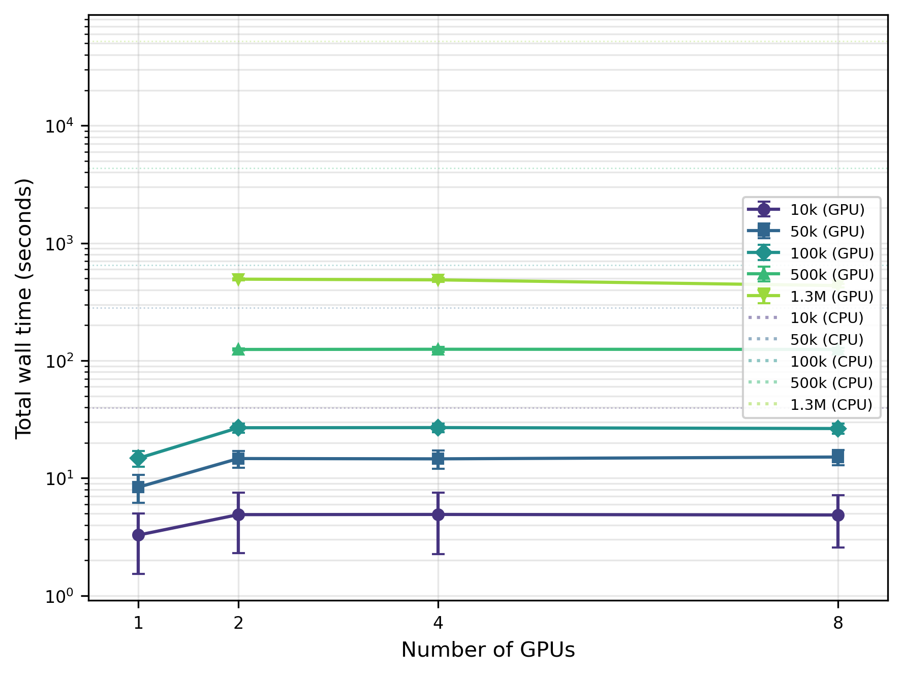
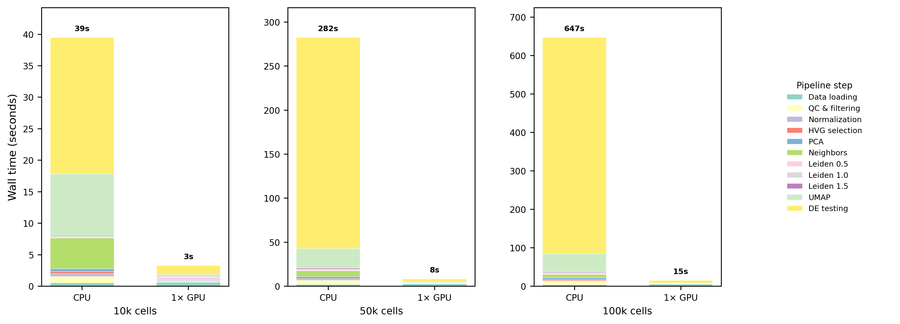
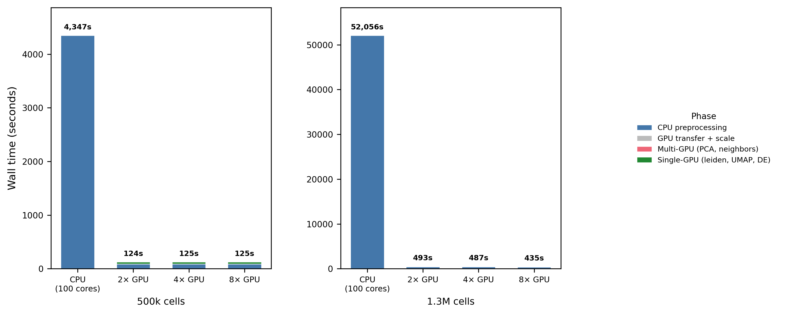

# Introduction

Single-cell RNA sequencing has become the standard technology for dissecting cellular heterogeneity in complex tissues [@Regev2017].
Recent atlas-scale projects such as the Human Cell Atlas, Tabula Sapiens [@TabulaSapiens2022], and the Allen Brain Atlas [@Yao2023] routinely generate datasets exceeding one million cells, placing severe computational demands on analysis pipelines.
The dominant analysis framework, Scanpy [@Wolf2018], executes on CPU and relies on NumPy, SciPy, and scikit-learn for linear algebra and graph operations.
While multi-threaded CPU implementations scale modestly with core count, a standard analysis of one million cells, encompassing quality control, normalisation, principal component analysis (PCA), neighbourhood graph construction, Leiden clustering [@Traag2019], uniform manifold approximation and projection (UMAP) [@McInnes2018], and differential expression (DE) testing, can require hours to days on a multi-core workstation.

In parallel, spatial transcriptomics has matured from low-throughput technologies to platforms that tile entire tissue sections with hundreds of thousands of measurement points.
The 10x Genomics Visium HD platform generates up to 6.3 million 2 um bins per tissue section, and spatial analysis pipelines built on Squidpy [@Palla2022] add computationally intensive operations such as spatial autocorrelation (Moran's I, Geary's C), co-occurrence analysis, and neighbourhood enrichment on top of the standard expression analysis workflow.
As both single-cell and spatial datasets grow, the need for GPU-accelerated analysis becomes increasingly pressing.

GPU-accelerated alternatives have emerged to address this scalability challenge.
The RAPIDS ecosystem [@RAPIDS2024] provides GPU-native implementations of common data science primitives, and rapids-singlecell [@Dicks2026] offers a near-drop-in replacement for Scanpy that executes the same analytical pipeline on NVIDIA GPUs via cuML, cuGraph, and CuPy.
Prior work has demonstrated substantial GPU speedups for genomic analyses [@TaylorWeiner2019], including single-cell pipelines [@Nolet2022], and proposed GPU frameworks for datasets exceeding ten million cells [@Hu2025].
However, most benchmarks report headline speedups without systematically examining (i) per-step performance variation, (ii) multi-GPU scaling behaviour and its bottlenecks, (iii) numerical concordance of GPU floating-point results with CPU baselines, and (iv) practical memory limits at extreme scale.
Gardner et al. [-@Gardner2025] recently evaluated accuracy-performance trade-offs for GPU single-cell analysis, but their study was limited to a single GPU and did not explore multi-GPU configurations or stress-test hardware limits.

Here we present a comprehensive benchmark addressing five questions simultaneously.
First, speed: what is the per-step and end-to-end speedup of rapids-singlecell relative to Scanpy on identical hardware?
Second, scalability: how does the pipeline scale from 1 to 8 GPUs (the full GPU complement of a single NVIDIA DGX H100 node), and where are the bottlenecks?
Third, concordance: do CPU and GPU pipelines yield biologically equivalent results in terms of HVG selection, PCA embeddings, clustering, and DE gene rankings?
Fourth, capacity: what is the maximum dataset size a single DGX H100 node can process, and what limits it?
Fifth, spatial generalisability: do the GPU speedup and concordance patterns extend from single-cell to spatial transcriptomics?

We benchmark both modalities on NVIDIA DGX H100 and RTX 4090 hardware, provide all code and containers for full reproducibility, and identify CPU-side preprocessing as the primary bottleneck limiting further scaling.

# Methods

## Single-cell RNA-seq

### Dataset and subsampling

All single-cell experiments used the 10x Genomics 1.3-million mouse brain cell dataset (E18) [@Zheng2017], obtained as a pre-processed AnnData h5ad file from the RAPIDS single-cell examples repository.
This dataset is the canonical large-scale single-cell benchmark and contains approximately 1.3 million cells with gene expression measured by the 10x Chromium platform.

To evaluate performance across scales, we created reproducible subsamples of 10,000, 50,000, 100,000, and 500,000 cells by uniform random sampling without replacement (`numpy.random.choice`, NumPy 2.2.6, seed = 42), in addition to the full 1.3M cell dataset.
All subsamples were derived from the same parent dataset to ensure consistent biological composition across benchmarking tiers.

### Analysis pipeline

Both the CPU and GPU pipelines implemented the standard Scanpy best-practices workflow [@Luecken2019; @Heumos2023] with identical parameters.
The CPU pipeline used Scanpy 1.12 [@Wolf2018] with NumPy 2.2.6 and the igraph Leiden backend (igraph 1.0.0); the GPU pipeline used rapids-singlecell 0.14.1 [@Dicks2026] with CuPy 13.6.0, the RAPIDS Memory Manager (RMM) 26.2.0, and the cuGraph Leiden backend.
Both pipelines shared the AnnData format [@Virshup2024] for data interchange.

The pipeline comprised ten steps, each timed independently using `time.perf_counter()` (Table 1).

: **Table 1.** Pipeline steps, parameters, and implementations for the scRNA-seq benchmark. All steps used identical parameters for the CPU and GPU pipelines except where noted. {#tbl:pipeline}

| Step | Operation | Key parameters | Implementation note |
|-----:|:----------|:---------------|:--------------------|
| 1 | Data loading | --- | `read_h5ad()` from disk |
| 2 | QC and filtering | `min_genes` = 200, `min_cells` = 3, mt prefix = `mt-` | Mitochondrial percentage calculated, cells/genes filtered |
| 3 | Normalisation | `target_sum` = 10,000 | Library-size scaling + `log1p` |
| 4 | HVG selection | `n_top_genes` = 2,000, Seurat v1 method | On log-normalised data [@Satija2015; @Yip2019] |
| 5 | Scaling | `max_value` = 10 | Sparse to dense float32, mean-centre, unit-variance |
| 6 | PCA | 50 components, seed = 42 | Truncated SVD |
| 7 | Neighbour graph | k = 15, 50 PCs, seed = 42 | k-NN in PCA space |
| 8 | Leiden clustering | r in {0.5, 1.0, 1.5}, seed = 42 | igraph (CPU) / cuGraph (GPU) [@Traag2019] |
| 9 | UMAP | 2 components, seed = 42 | 2D embedding [@McInnes2018] |
| 10 | DE testing | Wilcoxon, one-vs-rest, `use_raw` = True | On Leiden r = 1.0 clusters [@Soneson2018] |

For the CPU pipeline, threading was maximised by setting `OMP_NUM_THREADS`, `MKL_NUM_THREADS`, `OPENBLAS_NUM_THREADS`, and `NUMBA_NUM_THREADS` to 100 (the usable core count) before importing any numerical library. These variables target the thread pools of four distinct parallel backends that NumPy, SciPy, scikit-learn, and UMAP may dispatch to: OpenMP (used by OpenBLAS and several `sklearn` inner loops), Intel MKL, OpenBLAS, and Numba (the JIT backend of `umap-learn`). Only the pool corresponding to the BLAS library that NumPy was linked against at build time is actually active at runtime; the other variables are harmlessly ignored. We set all four to remain portable across container variants where the BLAS choice may differ; in our RAPIDS base image, NumPy is linked against OpenBLAS.
For single-GPU runs, the RMM pool allocator was initialised to pre-reserve GPU VRAM and amortise allocation cost across many small operations; a GPU warmup step was then executed to absorb CUDA context initialisation overhead before timing.

### Multi-GPU pipeline

For datasets exceeding single-GPU VRAM capacity (500k and 1.3M cells), we employed a hybrid multi-GPU pipeline using Dask-CUDA [@Rocklin2015].
Preprocessing steps (data loading, QC, normalisation, HVG selection) executed on CPU, as they are I/O- or memory-bound and do not benefit from GPU parallelism.
PCA and neighbour graph construction were distributed across N GPUs (N in {2, 4, 8}) via Dask workers, each with a 10 GB initial / 70 GB maximum RMM pool.
Scaling, Leiden clustering, UMAP, and DE testing executed on a single GPU (device 0), as they operate on the reduced PCA embedding or require global graph access.

### Concordance metrics

To assess whether the GPU pipeline produces biologically equivalent results, we selected six concordance metrics, one for each major stage of the analysis pipeline, such that a divergence at any stage would be detected independently of the others (Table 2). The panel follows the metric families adopted in published scRNA-seq method benchmarks [@Tian2019; @Duo2020; @Luecken2022], progressing from deterministic upstream operations (feature selection, dimensionality reduction) through graph and clustering steps to downstream differential expression.

: **Table 2.** Concordance metrics used to compare CPU and GPU pipeline outputs. {#tbl:concordance}

| Metric | Definition | Scope |
|:-------|:-----------|:------|
| HVG Jaccard | size of intersection divided by size of union of the CPU and GPU gene sets for 2,000 HVGs | Feature selection |
| PCA loading |rho| | Mean absolute Spearman rho across first 10 PC loadings, accounting for sign flips | Dimensionality reduction |
| kNN Jaccard | Mean per-cell Jaccard overlap of k-nearest-neighbour sets (k = 15) [@Luecken2022] | Graph structure |
| ARI | Adjusted Rand Index of Leiden cluster assignments, adjusted for chance [@Hubert1985] | Clustering |
| NMI | Normalised Mutual Information of cluster assignments [@Vinh2010] | Clustering |
| DE logFC rho | Spearman rho of log-fold-changes for top 100 DE genes per cluster, after Hungarian matching [@Soneson2018] | Differential expression |

### Stress test: maximum capacity

To determine the maximum dataset size processable on a single DGX H100 node, we implemented a memory-optimised pipeline variant.
The key optimisations were: (i) scaling on CPU rather than GPU (leveraging 2 TB system RAM); (ii) a distributed covariance PCA that scatters the scaled matrix across all 8 GPUs, computes local covariance contributions (X_i^T X_i, each 2,000 x 2,000), sums and eigendecomposes on GPU 0, then projects locally, which is mathematically equivalent to standard PCA via the covariance method; (iii) lean GPU transfer that replaces the dense matrix with an empty sparse placeholder after PCA, since downstream steps (neighbours, clustering, UMAP) only require the PCA embedding; and (iv) a reduced RMM pool (2 GB per worker).
We conducted a binary search from 3.4M to 13.7M cells to identify the failure point.

### Differential expression at scale

At 3.4 million cells x 41,000 genes x 81 Leiden clusters, the raw count matrix (`adata.raw.X`) occupies approximately 121 GB as a sparse CSR matrix, exceeding single-GPU VRAM.
We evaluated seven DE strategies in a factorial design crossing test type (Wilcoxon, t-test, pseudo-bulk) with GPU strategy (none, scatter-by-genes across 8 GPUs, chunk-and-stream on 1 GPU).
Gene chunks of 500 were used for GPU strategies (500 x 3.4M x 4 bytes approximately  6.8 GB per chunk, fitting within 80 GB VRAM).
Pseudo-bulk aggregation summed raw counts by donor x cluster, normalised to counts per million, log-transformed, and applied the Wilcoxon test on the aggregated matrix [@Squair2021].

## Spatial transcriptomics

### Datasets

Spatial benchmarks used two 10x Genomics public datasets:

1. Visium v1 Mouse Brain Sagittal Anterior: 2,695 spots at 55 um resolution, approximately 32,285 genes. The standard spot-based spatial transcriptomics platform.
2. Visium HD Mouse Brain (CytAssist, FFPE): binned at 8 um (393,543 bins) and 2 um (subsampled from 6.3 million to 389,492 bins), each with 19,059 genes. The Visium HD 2 um dataset was subsampled to approximately 400,000 bins using the `--max-spots` flag to fit within the RTX 4090's 24 GB VRAM; full-scale benchmarking of the complete 6.3 million bins requires DGX-class resources.

Both datasets were downloaded programmatically from the 10x Genomics public data portal.

### Spatial analysis pipeline

The spatial pipeline comprised two phases: an expression analysis phase (shared with the scRNA-seq pipeline) and a spatial statistics phase (Table 3).

: **Table 3.** Spatial analysis pipeline steps. Steps 1--8 share parameters with the scRNA-seq pipeline (Table 1) except for QC filtering, which used `min_genes` = 1 for Visium HD (Space Ranger pre-filters on-tissue barcodes). Steps 9--14 are spatial-specific. {#tbl:spatial_pipeline}

| Step | Operation | GPU support | Notes |
|-----:|:----------|:-----------:|:------|
| 1--8 | Expression analysis (QC through UMAP) | Yes | As in Table 1; Leiden r = 1.0 for Visium, r = 0.1 for HD |
| 9 | Spatial neighbours | No | Delaunay triangulation (scipy.spatial) |
| 10 | Moran's I | Yes | Spatial autocorrelation per gene |
| 11 | Geary's C | Yes | Spatial autocorrelation per gene |
| 12 | Co-occurrence | Yes | Cluster co-occurrence across distance intervals |
| 13 | Neighbourhood enrichment | No | Cluster--cluster proximity enrichment |
| 14 | Ligand-receptor interaction | No | Cell communication inference |

The CPU baseline used Scanpy 1.12 for expression steps and Squidpy 1.8.1 [@Palla2022] for spatial steps.
The GPU pipeline used rapids-singlecell 0.14.1 for both expression and GPU-accelerated spatial steps (Moran's I, Geary's C, co-occurrence).
Steps without GPU implementations (spatial neighbours, neighbourhood enrichment, ligand-receptor) were executed identically on CPU in both pipelines.

Co-occurrence and neighbourhood enrichment were skipped when cluster counts exceeded 500, as their O(k^2) memory complexity becomes prohibitive.
Ligand-receptor interaction analysis was skipped for datasets exceeding 100,000 spots.

### Spatial concordance metrics

We compared CPU and GPU spatial outputs using four concordance measures:

1. Spatial autocorrelation concordance: Spearman rho between CPU and GPU per-gene Moran's I (and Geary's C) statistics across all genes.
2. Spatially variable gene (SVG) Jaccard: overlap of the top-N SVGs (N in {50, 100, 200}) ranked by Moran's I, and overlap of all genes with FDR < 0.05.
3. Clustering ARI/NMI: agreement of Leiden cluster assignments from the expression-based pipeline.
4. Co-occurrence Spearman rho: correlation of the full co-occurrence matrices.

## Hardware and software environment

Single-cell benchmarks ran on a single node of the UPSCALE/CONVECS DGX H100 cluster at the University of Padova, comprising 8 x NVIDIA H100 80 GB SXM GPUs connected via NVLink 4.0, dual Intel Xeon Platinum 8480C CPUs (112 cores total), and 2 TB DDR5 RAM.
The software environment was encapsulated in a Singularity container built from the NVIDIA RAPIDS base image (`nvcr.io/nvidia/rapidsai/base:26.02-cuda12-py3.12`).
Key software versions: Scanpy 1.12, rapids-singlecell 0.14.1, CuPy 13.6.0, Dask 2026.1.1, Dask-CUDA 26.2.0, Python 3.12.12.
Jobs were submitted via SLURM on a dedicated DGX H100 node (`poddgx02`).

Spatial benchmarks ran on a local workstation equipped with an NVIDIA RTX 4090 (24 GB GDDR6X), 100 CPU cores, and 256 GB DDR5 RAM, driven by a more recent NVIDIA driver (550.x).
A separate container was built from `nvcr.io/nvidia/rapidsai/base:26.02-cuda12-py3.12` with Squidpy 1.8.1 [@Palla2022] and spatialdata [@Marconato2024] dependencies.
DGX-scale spatial benchmarks were not feasible within the study timeline: although the scRNA pipeline executed successfully on the DGX node via CUDA forward-compatibility, the GPU components of the spatial pipeline failed on the cluster's driver (535.183.01), which caps CUDA runtime at 12.2.
We attempted to downgrade the spatial container to an earlier RAPIDS release known to be driver-compatible (RAPIDS 25.02), but the spatial dependency stack (rapids-singlecell 0.14, Squidpy GPU-backend, spatialdata) could not be resolved against the older RAPIDS wheels.
Porting the full spatial pipeline to a driver-compatible RAPIDS release therefore remains future work.

Each benchmark configuration was repeated five times; we report mean +/- standard deviation.
For spatial benchmarks, the first repeat served as a JIT/warmup run and was excluded; we report the mean of repeats 2--5.

## Reproducibility

All code, Dockerfiles, SLURM submission scripts, and result JSON files are available at <https://github.com/lucavd/2026.scRNA_DGX>.
All benchmarks ran in Python 3.12 inside a Singularity container built from the Docker image `lucavd/sc-benchmark:latest` (base image `nvcr.io/nvidia/rapidsai/base:26.02-cuda12-py3.12`), which pins the full package environment declared in Section "Analysis pipeline" (Scanpy 1.12, rapids-singlecell 0.14.1, CuPy 13.6.0, RMM 26.2.0, NumPy 2.2.6, igraph 1.0.0).
Random seeds were fixed at 42 for all stochastic operations: subsampling (`numpy.random.choice`), PCA (`sc.pp.pca` / `rsc.pp.pca`), Leiden (`sc.tl.leiden` / `rsc.tl.leiden`), and UMAP (`sc.tl.umap` / `rsc.tl.umap`).
We note that GPU floating-point arithmetic is non-deterministic due to non-associative parallel reductions [@Shanmugavelu2024; @Collange2015], and quantify the resulting divergence through the concordance metrics above rather than expecting bit-identical outputs.

# Results

## Single-cell RNA-seq

### GPU acceleration achieves up to 120-fold end-to-end speedup

Table 4 summarises the benchmark results across all 23 pipeline-dataset-GPU configurations, each averaged over five repeats.
At 1.3 million cells, the 8-GPU pipeline completed the full analysis in 435.2 +/- 16.2 s (7.3 min), compared with 52,056.2 +/- 392.0 s (14.5 h) for the CPU pipeline, a 119.6-fold speedup (Fig. 6).
Even at 10,000 cells, the single-GPU pipeline was 12-fold faster than the CPU baseline (3.3 +/- 1.7 s vs 39.5 +/- 10.2 s).
The speedup increased monotonically with dataset size: 33.6x at 50k, 43.7x at 100k, 34.9x at 500k (2 GPU), and 119.6x at 1.3M (8 GPU), reflecting the GPU's superior arithmetic throughput on larger matrices.

: **Table 4.** Summary of scRNA-seq benchmark results across all pipeline configurations. Times are mean +/- SD over five repeats. Single-GPU results for 500k and 1.3M cells are absent because the standard pipeline exceeded 80 GB VRAM on a single H100. {#tbl:summary}

| Pipeline | Cells | GPUs | Total time (s) | SD (s) | Peak RAM (GB) | Peak VRAM (GB) |
|:---------|------:|-----:|---------------:|-------:|---------------:|---------------:|
| CPU (Scanpy) | 10k | 0 | 39.5 | 10.2 | 1.2 | --- |
| GPU (rapids) | 10k | 1 | 3.3 | 1.7 | 2.4 | 40.7 |
| GPU | 10k | 2 | 4.9 | 2.6 | 2.3 | 52.4 |
| GPU | 10k | 4 | 4.9 | 2.6 | 2.3 | 65.0 |
| GPU | 10k | 8 | 4.9 | 2.3 | 2.3 | 106.5 |
| CPU (Scanpy) | 50k | 0 | 282.5 | 9.1 | 3.6 | --- |
| GPU (rapids) | 50k | 1 | 8.4 | 2.2 | 5.4 | 40.7 |
| GPU | 50k | 2 | 14.7 | 2.4 | 3.5 | 52.4 |
| GPU | 50k | 4 | 14.6 | 2.6 | 3.5 | 65.0 |
| GPU | 50k | 8 | 15.1 | 2.2 | 3.4 | 106.5 |
| CPU (Scanpy) | 100k | 0 | 646.7 | 10.5 | 6.7 | --- |
| GPU (rapids) | 100k | 1 | 14.8 | 2.2 | 8.8 | 40.7 |
| GPU | 100k | 2 | 26.9 | 2.4 | 4.9 | 52.4 |
| GPU | 100k | 4 | 26.9 | 2.3 | 4.9 | 65.1 |
| GPU | 100k | 8 | 26.4 | 2.6 | 4.9 | 106.6 |
| CPU (Scanpy) | 500k | 0 | 4,346.7 | 40.3 | 29.7 | --- |
| GPU | 500k | 2 | 124.5 | 2.9 | 15.6 | 52.7 |
| GPU | 500k | 4 | 125.0 | 6.0 | 15.9 | 65.5 |
| GPU | 500k | 8 | 124.6 | 3.7 | 15.5 | 107.0 |
| CPU (Scanpy) | 1.3M | 0 | 52,056.2 | 392.0 | 107.4 | --- |
| GPU | 1.3M | 2 | 493.3 | 10.3 | 60.7 | 74.9 |
| GPU | 1.3M | 4 | 486.6 | 20.2 | 60.7 | 92.7 |
| GPU | 1.3M | 8 | 435.2 | 16.2 | 52.3 | 134.2 |

### Per-step speedup varies over two orders of magnitude

The per-step speedup heatmap (Fig. 1) reveals that GPU advantage varies dramatically by operation type, ranging across nearly two orders of magnitude depending on algorithmic structure and data size. Trivially parallelisable operations achieve the highest speedups: normalisation, which involves only element-wise division and logarithm, reached 329x at 10k cells, 206x at 50k cells, and 173x at 100k cells. Similarly efficient GPU operations include HVG selection (24--94x speedup), neighbours graph construction (44--88x), UMAP (27--45x), and differential expression testing (16--88x), all reflecting the fine-grained parallelism available on modern GPUs. PCA showed a more moderate but still substantial speedup that increased with dataset size, from 4.8x at 10k cells to 36.5x at 100k cells, consistent with the increasing arithmetic intensity of singular value decomposition on larger matrices.

However, not all operations benefited equally from GPU acceleration. Data loading from disk was actually faster on CPU across all scales (0.76--0.85x GPU/CPU), because the fixed overhead of CUDA context initialisation and RMM pool allocation dominated the short data transfer itself: PCIe Gen5 bandwidth (128 GB/s) is not saturated at these sub-gigabyte dataset sizes, and the transfer completes in milliseconds. We note that our pipeline relies on `h5py`-based readers that route data through CPU RAM, precluding GPU Direct Storage (GDS) optimisations that would bypass the CPU entirely; this remains an avenue for future improvement. Similarly, Leiden clustering showed a clear dependence on problem size: at 10k cells, CPU was faster (0.36x) due to cuGraph's higher constant-time overhead for graph partitioning operations on small graphs, but GPU performance improved substantially as the graph size increased, with GPU overtaking CPU at 50k cells (1.80x speedup) and achieving 3.58x speedup at 100k cells.

### Multi-GPU scaling is sublinear: CPU preprocessing dominates

Adding GPUs beyond two provided diminishing returns (Fig. 2, Fig. 6).
At 500k cells, wall time was virtually identical for 2, 4, and 8 GPUs (124.5, 125.0, and 124.6 s, respectively).
At 1.3M cells, 8 GPUs (435.2 s) were only 12% faster than 2 GPUs (493.3 s).

The timing breakdown (Fig. 6) reveals why: in a representative 8-GPU run at 1.3M cells (total 463.4 s), CPU preprocessing (data loading + QC + normalisation + HVG selection) consumed 348.7 s (75%), the multi-GPU phase (PCA + neighbours) took only 17.5 s (4%), and single-GPU operations (transfer + scale + Leiden + UMAP + DE) took 97.2 s (21%).
Since CPU preprocessing is constant regardless of GPU count, and Leiden/UMAP/DE execute on a single GPU, only the PCA and neighbour steps benefit from additional GPUs, a classic instance of Amdahl's law [@Amdahl1967].

### CPU and GPU produce biologically concordant results

Concordance analysis on the 10,000-cell dataset (Fig. 3) demonstrated that the two pipelines yield near-identical biological conclusions, despite computing on different processors and hardware. Upstream analysis steps showed deterministic agreement: HVG selection was perfectly concordant with all 2,000 genes identical between CPU and GPU (Jaccard = 1.000), and PCA loadings were perfectly correlated with mean absolute Spearman rho = 1.000 across all 10 inspected principal components. Neighbourhood graph construction achieved high overlap with mean Jaccard = 0.930 (median = 0.938), though some variation in the k-nearest neighbours across the graph was expected due to floating-point precision differences.

Clustering concordance showed expected variations due to algorithm stochasticity. Leiden clustering at different resolutions yielded adjusted Rand indices ranging from 0.908 (resolution 1.0) to 0.963 (resolution 1.5), with corresponding normalised mutual information values from 0.951 to 0.971. The slightly lower concordance at resolution 1.0, where both pipelines identified 40 clusters, reflects the inherent stochasticity of the Leiden algorithm and minor differences in the underlying graph-partitioning implementations provided by cuGraph (GPU) versus igraph (CPU), rather than indicating any systematic bias. The downstream biological results also aligned well: differential expression log-fold-changes across 40 matched cluster pairs showed mean Spearman correlation of 0.946, with 30 of the 40 pairs exceeding the stringent threshold of rho > 0.97.

These concordance levels are consistent with the range of inter-method variation reported in mixture-control benchmarks of scRNA-seq analysis pipelines [@Tian2019] and systematic evaluations of clustering algorithm variability [@Duo2020], and support the conclusion that GPU and CPU pipelines are interchangeable for biological interpretation.

### Memory is not a bottleneck at benchmark scale

At the scales covered by the main benchmark (10k to 1.3M cells), neither memory tier was saturated. CPU RAM usage scaled approximately linearly with cell count, from 1.2 GB at 10k to 107.4 GB at 1.3M cells (Fig. 4, left panel), well below 6% of the 2 TB system memory. The dominant in-memory objects at 1.3M cells were the dense float32 matrix created during scaling (1.3M x 2,000 HVGs x 4 bytes approximately  10.4 GB) and the sparse raw count matrix (1.3M x 39,182 genes). GPU VRAM for single-GPU runs was approximately constant at 40.7 GB across dataset sizes, dominated by the pre-allocated RMM pool. For multi-GPU runs, aggregate VRAM scaled with worker count: at 1.3M cells with 8 GPUs, the aggregate peak was 134.2 GB (mean 16.8 GB per device, 21% of 80 GB capacity), well below the per-device limit. At these scales, therefore, end-to-end throughput is set by compute and I/O, not memory; CPU RAM becomes the binding constraint only in the extreme stress-test regime discussed in the next subsection.

To verify that distributed computation was actually occurring across all workers (rather than silently collapsing onto a single GPU, as reported for some Dask-CUDA configurations), two independent pieces of evidence support the multi-GPU claim. First, the aggregate peak VRAM at 1.3M cells with 8 GPUs (134.2 GB) exceeds the 80 GB capacity of any single H100 device; this working set could not have fit on one GPU alone, so data must have been distributed across at least two devices. Second, we verified through direct scheduler queries (`client.run_on_scheduler()`) that all requested workers were in the `running` state throughout each benchmark, after identifying and fixing a reporting bug in the client-side cache (`client.scheduler_info()`) that occasionally undercounted active workers. Per-device VRAM traces (available in the benchmark result JSON files in the code repository) show balanced usage across workers during the PCA and neighbour phases and fall back to a single-GPU footprint only during Leiden and UMAP, which are implemented as single-GPU operations in cuGraph 26.2.

### Stress test: 11.9 million cells on one DGX H100 node

To locate the true capacity limit of the DGX H100 node, we ran a separate stress test with the *memory-optimised pipeline* described in Methods (Section "Stress test: maximum capacity"). This variant moves scaling to CPU (exploiting the 2 TB system RAM), distributes PCA across all 8 GPUs via a covariance-matrix method, and replaces the full data matrix on GPU with an empty sparse placeholder after PCA so that only the low-dimensional embedding (n x 50 floats) resides on any GPU.

A binary search for the maximum processable cell count (Table 5) showed that the pipeline succeeded at 11.9 million cells (119 min) and failed at 12.0 million cells (Leiden out-of-memory, SLURM signal 9). A separate test at 13.7 million cells failed earlier, during the CPU-side sparse-to-dense scaling step.

The failure point is counter-intuitive at first reading: the stable peak RAM at 11.9M was 535 GB (26% of the 2 TB machine, 30% of the 1.8 TB SLURM job allocation), leaving apparent headroom. Stable peak aggregate VRAM was only 49 GB out of 640 GB (7.6%). Neither of these stable figures alone explains why 12M cells fails. The actual capacity limit is imposed by **transient memory peaks during individual preprocessing operations**: spikes that briefly multiply the stable footprint and that `psutil` samples only sporadically (Table 6). The combined working set during Leiden graph construction at 12M nodes exceeds the 1.8 TB SLURM allocation, triggering cgroup SIGKILL. The 13.7M failure is a distinct transient spike during sparse-to-dense scaling that saturates memory even earlier.

Critically, GPU VRAM is never the limiting factor in this pipeline. Aggregate VRAM remained flat at approximately 49 GB (7.6% of total 640 GB) from 6.9M to 11.9M cells, because the distributed covariance PCA keeps per-GPU memory at approximately 6.7 GB and the lean GPU transfer only places the PCA embedding (n cells x 50 components x 4 bytes) on GPU 0. In other words, the DGX has eleven times more GPU memory than the pipeline consumes at its maximum tested cell count; pushing capacity further would require reducing CPU-side transient peaks (notably the Leiden working set and the `adata.raw` duplication), not scaling GPU memory.

We also tested cuML KMeans as a GPU-native clustering alternative to Leiden, but the failure point was identical (13.7M) because the out-of-memory event occurred during CPU preprocessing, before clustering was invoked.
Similarly, a sparse-scatter optimisation that avoided the CPU-side dense matrix was tested at 14M cells but failed during Scanpy's HVG selection step, confirming that Scanpy's CPU-side preprocessing is the ultimate capacity bottleneck.

Inspired by the chunked-preprocessing strategy of ScaleSC [@Hu2025], we also implemented a third variant that performs HVG selection on per-gene running statistics accumulated over 100,000-cell batches and computes PCA via batch-wise covariance accumulation, both directly from the sparse matrix without ever materialising a dense intermediate on CPU. This variant succeeded at 12.0 million cells (862 GB peak RAM, 156 min) but failed at 15.0 million cells during the CSR-to-CSC layout conversion required for HVG column slicing. The marginal improvement over the non-chunked optimised pipeline (12.0M vs 11.9M cells) confirmed that chunking the compute steps does not by itself remove the CPU-RAM bottleneck: the binding constraint is Scanpy's resident sparse matrix, the `adata.raw` duplication, and the eventual dense layout transform, none of which are eliminated by chunked compute. Notably, in this chunked variant aggregate VRAM dropped from 49 GB to 10 GB (a five-fold reduction), reinforcing the conclusion that GPU memory is not the limiting resource for current single-cell workflows even when data are streamed in batches across all 8 GPUs.

The memory limit is fundamentally a function of cells x genes, not cells alone, because the dense scaled matrix that scanpy materialises during preprocessing must occupy n x 2,000 x 4 bytes in one contiguous CPU allocation (the sparse input is chunk-loadable, but the dense scaled output is not). With 2,000 HVGs and float32 precision, fewer HVGs would permit more cells (estimated 20M at 1,000 HVGs) and vice versa (estimated 4M at 5,000 HVGs). The same tradeoff applies to the `adata.raw` backup kept for DE testing and to any downstream step that requires the full cells x HVGs array in memory.

: **Table 5.** Stress test results: maximum cell count on a single DGX H100 node (8xH100, 2 TB RAM) using the memory-optimised pipeline. Timings exclude DE testing, which was benchmarked separately (Table 7). {#tbl:stress}

| Cells | Runtime (min) | CPU RAM (GB) | GPU VRAM (GB) | Status |
|------:|--------------:|-------------:|--------------:|:-------|
| 3.4M | 18 | 155 | 49 | Pass |
| 6.9M | 35 | 308 | 49 | Pass |
| 10.3M | 73 | 465 | 49 | Pass |
| 11.5M | 114 | 517 | 49 | Pass |
| 11.9M | 119 | 535 | 49 | **Pass (max)** |
| 12.0M | --- | --- | --- | Fail (Leiden OOM) |
| 13.7M | --- | --- | --- | Fail (scale OOM) |

[VERIFY: Times for 3.4M, 6.9M, and 10.3M rows. The JSON result files for these sizes used different pipeline configurations (3.4M included DE testing; 6.9M and 10.3M used KMeans instead of Leiden). The values in this table come from CLAUDE.md project documentation and may reflect earlier runs with Leiden + skip-DE that were not saved as JSON. The 11.5M and 11.9M values match their JSON files exactly.]

: **Table 6.** Memory budget at the 12M-cell failure point, showing why the stable 535 GB baseline translates to an out-of-memory event. Baseline values are measured (the 535 GB subtotal matches the last successful run at 11.9M cells). Transient peak contributions are estimated from operation-specific memory formulas and are not fully captured by interval-based `psutil` sampling; the combined peak during Leiden is what exceeds the 1.8 TB SLURM allocation and triggers OOM at 12M. {#tbl:memory_budget}

| Memory usage at 12M cells | GB |
|:--------------------------|---:|
| **Baseline (stable peak, measured at 11.9M)** | |
| &nbsp;&nbsp;&nbsp;&nbsp;Sparse raw matrix `adata.X` (CSR, ~5% density) | ~190 |
| &nbsp;&nbsp;&nbsp;&nbsp;Sparse raw copy `adata.raw` (DE backup) | ~190 |
| &nbsp;&nbsp;&nbsp;&nbsp;Dense scaled HVG matrix (12M x 2,000, float32) | 96 |
| &nbsp;&nbsp;&nbsp;&nbsp;Scanpy metadata + Python runtime + allocator overhead | ~60 |
| &nbsp;&nbsp;&nbsp;&nbsp;*Measured subtotal (11.9M, stable)* | **535** |
| **Transient peaks during individual operations** | |
| &nbsp;&nbsp;&nbsp;&nbsp;CSR to CSC layout conversion | +190 |
| &nbsp;&nbsp;&nbsp;&nbsp;Sparse to dense scaling (`sc.pp.scale`) | +200 |
| &nbsp;&nbsp;&nbsp;&nbsp;`adata.raw = adata.copy()` | +400 |
| &nbsp;&nbsp;&nbsp;&nbsp;Leiden graph construction (igraph + partitions at 12M nodes, k=15) | +700 to 1,000 |
| &nbsp;&nbsp;&nbsp;&nbsp;*Estimated combined peak during Leiden* | **~1,500** |
| SLURM job allocation (`#SBATCH --mem=1800G`) | 1,800 |
| Physical machine memory | 2,048 |

### Differential expression: pseudo-bulk is fastest and most correct

The factorial differential expression benchmark at 3.4 million cells across 41,000 genes and 81 Leiden clusters (Table 7) revealed important trade-offs between computational efficiency and statistical rigor. To keep the table tractable we reported all wall times against a single CPU denominator, the t-test (5,598 s): a CPU Wilcoxon baseline at this scale was infeasible to measure (extrapolation from smaller subsamples places it above four hours), and pseudo-bulk operates on a different sample unit (donor x cluster pseudo-samples rather than individual cells), so no strict within-method CPU-to-GPU ratio exists for it. Consequently, the speedup column should be read as "which approach finishes fastest overall", not as a within-method GPU acceleration factor; t-test and Wilcoxon are distinct statistical tests with different computational complexity, and any direct runtime comparison between them is descriptive, not inferential.

: **Table 7.** Differential expression benchmark at 3.4M cells x 41k genes x 81 Leiden clusters. Speedup is relative to CPU t-test (5,598 s). {#tbl:de}

| Method | Backend | GPUs | Time (s) | Speedup |
|:-------|:--------|-----:|---------:|--------:|
| t-test | CPU | 0 | 5,598 | 1.0x |
| Pseudo-bulk (Wilcoxon) | CPU (aggregated) | 0 | 128 | 43.7x |
| Wilcoxon (scatter) | GPU | 8 | 826 | 6.8x |
| Wilcoxon (chunk-stream) | GPU | 1 | 831 | 6.7x |
| t-test (scatter) | GPU | 8 | 1,656 | 3.4x |
| t-test (chunk-stream) | GPU | 1 | 1,650 | 3.4x |

Pseudo-bulk aggregation emerged as the dominant strategy across both dimensions: aggregating raw counts by donor and cluster reduced the analysis from 3.4 million individual cells to a few hundred pseudo-samples per cluster, completing in just 128 seconds (2.1 minutes). This represented a 43.7x speedup compared to the cell-level CPU t-test baseline (5,598 s, 93 minutes). Beyond its computational advantages, pseudo-bulk aggregation represents the statistically correct approach for multi-donor scRNA-seq experiments because it avoids pseudoreplication and properly accounts for inter-donor variability [@Squair2021].

GPU acceleration of cell-level tests provided more modest but still substantial speedups. Wilcoxon ranking tests on GPU, distributed across 8 H100 GPUs, completed in 826 seconds and achieved a 6.8x speedup over the CPU baseline. Counterintuitively, Wilcoxon outperformed GPU t-test (1,656 s, 3.4x speedup), because the Wilcoxon test's ranking operation maps efficiently to CuPy's `argsort` function on sparse data matrices, whereas the t-test requires computing dense mean and variance tensors. Multi-GPU distribution provided no additional advantage: Wilcoxon results were nearly identical whether computed across 8 GPUs via gene scattering (826 s) or streamed through a single GPU in sequential chunks (831 s). This parity reveals that the computational bottleneck in cell-level DE is not the statistical computation itself, but rather the sequential I/O cost of converting sparse matrices to dense gene chunks for GPU processing.

## Spatial transcriptomics

### GPU speedup scales dramatically with platform resolution

Table 8 summarises the spatial benchmark results across three Visium platforms.

: **Table 8.** Spatial transcriptomics benchmark results (RTX 4090, mean of repeats 2--5). {#tbl:spatial_summary}

| Platform | Spots/Bins | CPU total (s) | GPU total (s) | Speedup | CPU RAM (GB) | GPU VRAM (GB) |
|:---------|----------:|---------------:|--------------:|--------:|-------------:|--------------:|
| Visium v1 | 2,695 | 10.0 | 6.0 | 1.7x | 1.3 | 12.9 |
| Visium HD 8 um | 393,543 | 4,068 | 79 | 51.6x | 8.1 | 22.6 |
| Visium HD 2 um | 389,492 | 1,042 | 97 | 10.8x | 10.8 | 22.6 |

End-to-end speedup increased from 1.7x on Visium v1 (2,695 spots) to 51.6x on Visium HD 8 um (393,543 bins), demonstrating that GPU acceleration becomes increasingly valuable as spatial resolution increases.

The dominant contributor to the HD 8 um speedup was co-occurrence analysis, which achieved a 3,272x speedup (from 3,573 s on CPU to 1.09 s on GPU).
The CPU implementation computes pairwise cluster co-occurrence across distance intervals with O(n^2) complexity per interval, while the GPU implementation parallelises this computation across all bins and intervals simultaneously.
At 393,543 bins with 7 Leiden clusters, co-occurrence alone consumed 88% of the CPU pipeline time.

Other large GPU advantages on HD 8 um included PCA (257x), normalisation (176x), spatial autocorrelation (162--163x), and UMAP (159x).
Leiden clustering achieved a 16x speedup, and k-NN graph construction achieved 20x.

: **Table 9.** Per-step wall time and GPU speedup for spatial-specific operations on Visium HD 8 um (393,543 bins), the platform showing the largest overall speedup. Steps labelled "CPU-only" in the Speedup column lack a GPU implementation in rapids-singlecell 0.14.1; the "GPU (s)" value for those rows reports the wall time of the CPU fallback executed transparently inside the GPU pipeline, not a GPU-accelerated measurement. {#tbl:spatial_steps}

| Step | CPU (s) | GPU (s) | Speedup |
|:-----|--------:|--------:|--------:|
| Co-occurrence | 3,573 | 1.09 | 3,272x |
| PCA | 72.8 | 0.28 | 257x |
| Normalisation | 0.65 | 0.004 | 176x |
| Moran's I | 47.9 | 0.30 | 162x |
| Geary's C | 47.4 | 0.29 | 163x |
| UMAP | 194.3 | 1.22 | 159x |
| HVG selection | 0.94 | 0.012 | 76x |
| Expression neighbours | 39.4 | 2.00 | 20x |
| Leiden clustering | 19.2 | 1.17 | 16x |
| Spatial neighbours | 55.9 | 57.4 | 1.0x (CPU-only) |
| Nhood enrichment | 11.8 | 11.4 | 1.0x (CPU-only) |

Visium HD 2 um showed a lower overall speedup (10.8x) despite a similar bin count (389,492) because co-occurrence analysis was skipped (>500 clusters exceeded the O(k^2) memory threshold).
Without this step, UMAP dominated the GPU pipeline time (92x speedup, but consuming 92% of the 97 s total GPU time).

On Visium v1, the modest 1.7x overall speedup reflects the small dataset size (2,695 spots): GPU kernel launch overhead is not amortised, and CPU-only steps (spatial neighbours, ligand-receptor) dominate.

Three pipeline steps lacked GPU implementations and constituted the GPU pipeline's primary bottleneck: spatial neighbours (Delaunay triangulation via scipy.spatial, ~55 s on all HD platforms), neighbourhood enrichment (CPU-only), and ligand-receptor interaction (CPU-only, Visium v1 only).
Spatial neighbours alone represented 57--73% of total GPU pipeline time on HD platforms.

### Spatial concordance: near-perfect for spatial statistics, divergent for clustering at high resolution

Spatial autocorrelation concordance was near-perfect across all platforms (Table 10).
Moran's I and Geary's C Spearman correlations between CPU and GPU exceeded 0.9995 in all cases.
The top-50 spatially variable genes were identical (Jaccard = 1.0) across all three platforms, confirming that GPU-accelerated spatial autocorrelation produces scientifically equivalent results.
At the FDR < 0.05 threshold, SVG overlap remained high: 100% (Visium v1), 99.9% (HD 8 um), and 98.2% (HD 2 um).

: **Table 10.** Spatial concordance between CPU and GPU pipelines. SVG Jaccard reports the overlap of top-N spatially variable genes ranked by Moran's I. {#tbl:spatial_concordance}

| Metric | Visium v1 | HD 8 um | HD 2 um |
|:-------|----------:|------------:|------------:|
| Moran's I Spearman rho | 1.0000 | 0.9999 | 1.0000 |
| Geary's C Spearman rho | 1.0000 | 0.9995 | 0.9999 |
| SVG Jaccard (top 50) | 1.000 | 1.000 | 1.000 |
| SVG Jaccard (FDR < 0.05) | 1.000 | 0.999 | 0.982 |
| Cluster ARI | 0.856 | 0.974 | 0.080 |
| Cluster NMI | 0.892 | 0.940 | 0.667 |
| N clusters (CPU / GPU) | 16 / 15 | 7 / 3 | 2,559 / 538 |

Expression-based Leiden clustering showed platform-dependent concordance.
On Visium v1 (ARI = 0.856, NMI = 0.892) and HD 8 um (ARI = 0.974, NMI = 0.940), concordance was high, consistent with the scRNA-seq results.
However, on HD 2 um, clustering diverged substantially (ARI = 0.080, NMI = 0.667): the CPU pipeline identified 2,559 clusters while the GPU pipeline found 538.
This 4.75x difference in cluster granularity arises from algorithmic differences between the leidenalg (CPU) and cuGraph (GPU) Leiden implementations, which are amplified at high resolution where the graph has many near-degenerate partitions.
Subsampling from 6.3 million to 389,492 bins also disrupts spatial contiguity, compounding the effect.
This is a known limitation of comparing stochastic graph-partitioning algorithms across implementations, not a deficiency of GPU computation per se.

### Memory usage is modest across spatial platforms

Peak GPU VRAM was 12.9 GB on Visium v1 and plateaued at 22.6 GB for both HD platforms (Table 8), well within the RTX 4090's 24 GB capacity.
CPU RAM ranged from 1.3 GB (Visium v1) to 10.8 GB (HD 2 um).
These modest requirements suggest that spatial benchmarks at full Visium HD resolution (6.3M bins at 2 um) would fit comfortably within DGX H100 memory.

# Discussion

Our benchmark demonstrates that rapids-singlecell on NVIDIA H100 GPUs delivers consistent, large-magnitude speedups over Scanpy for the standard scRNA-seq analysis pipeline, with high biological concordance and practical scalability to nearly 12 million cells on a single DGX H100 node.
The extension to spatial transcriptomics shows that GPU advantages are even more pronounced for spatial-specific operations, with co-occurrence analysis achieving over three orders of magnitude speedup.
These results reveal several important insights about GPU-accelerated single-cell analysis that merit detailed discussion.

The fundamental constraint underlying our results is that GPU speedup is inherently operation-specific and highly dependent on the computational structure of each step. Normalisation and neighbour graph construction represent ideal GPU workloads, achieving speedups of 88--329x and 44--88x respectively, because they involve high arithmetic intensity and are trivially parallelisable across many data elements. In contrast, data loading from disk and Leiden clustering on small graphs show no GPU advantage or even a CPU advantage, but for different reasons. For data loading the culprit is not bandwidth: at sub-gigabyte dataset sizes PCIe Gen5 (128 GB/s) is far from saturated and the transfer itself completes in milliseconds; what dominates the GPU-side cost is the fixed overhead of CUDA context initialisation and RMM pool allocation, and our pipeline additionally routes `h5py`-based reads through CPU RAM rather than via GPU Direct Storage. Leiden clustering on small graphs is limited by low arithmetic intensity: consistent with the roofline model [@Williams2009; @Lindegger2023], cuGraph's constant-time overhead exceeds CPU's short runtime when the graph has few nodes, and the GPU compute units are not saturated. This heterogeneous speedup landscape has important practical implications for practitioners: GPU acceleration is most valuable for large datasets where the compute-heavy operations dominate overall runtime, whereas on small datasets the overhead of GPU operations may outweigh their benefits.

This step-level heterogeneity extends into multi-GPU scaling behaviour. The relatively modest 12% improvement from 2 to 8 GPUs at 1.3M cells reflects a fundamental constraint imposed by pipeline structure: only PCA and neighbour graph construction exploit distributed GPU computation, while the remaining 95% of wall time is spent on inherently sequential CPU preprocessing or single-GPU operations. This imbalance represents a classic manifestation of Amdahl's law [@Amdahl1967], where the non-parallelised fraction dominates overall speedup. Future frameworks could address this bottleneck by distributing preprocessing operations (e.g., chunked QC and normalisation across GPUs) and parallelising Leiden clustering across partitions, but such changes would require substantial modifications to the existing Scanpy architecture. A practical consequence for resource allocation follows from this constraint: because the marginal speedup of adding GPUs to a single run is only approximately 12%, a DGX H100 node is more efficiently utilised as eight independent single-GPU workers running concurrent analyses (yielding near-linear throughput scaling in the number of concurrent studies) than as an eight-way worker for one analysis at a time. This is a non-obvious but important takeaway for groups operating shared GPU infrastructure: the capital-intensive DGX platform delivers its greatest return when treated as a cluster of eight H100 workstations, not as one 8xH100 supercomputer.

Related to this, most of the practical value of the GPU speedup is accessible without a DGX at all. At dataset sizes below 500,000 cells the full standard pipeline fits on a single H100 GPU, and the memory-optimised variant described here extends single-GPU feasibility to 1.3M cells and beyond. Single H100 GPUs are readily rentable on commercial cloud platforms at approximately USD 2 to 4 per hour, so the 120x speedup at 1.3M cells reported here (reducing a 14.5-hour CPU analysis to 7.3 minutes) translates to well under one dollar of compute rental for an entire atlas-scale analysis. Access to a full DGX is therefore not a prerequisite for adopting these methods; the results are directly relevant to individual researchers and small groups with pay-as-you-go cloud budgets.

The biological outputs of GPU and CPU pipelines show high agreement despite computing on fundamentally different architectures and hardware. The perfect concordance on HVG selection (Jaccard = 1.000) and PCA loadings (Spearman rho = 1.000) reflects the deterministic nature of these operations given identical numerical inputs. The adjusted Rand indices for Leiden clustering range from 0.908 to 0.963 across different resolutions, entirely consistent with the algorithm's inherent stochasticity across implementations (igraph vs cuGraph) and with published benchmarks of clustering variability in scRNA-seq workflows [@Duo2020]. Floating-point non-associativity in GPU parallel reductions contributes negligibly to observed differences, as the dominant source of variation is the Leiden algorithm's non-deterministic vertex ordering. This level of concordance is reassuring for practitioners: it indicates that GPU-accelerated and CPU-based analyses remain interchangeable for biological interpretation and conclusions.

Perhaps most importantly, our findings reveal that CPU-side memory pressure during preprocessing, not GPU VRAM, is the binding constraint on scalability at extreme scale. This challenges the common intuition that GPU memory availability limits GPU-accelerated analysis. At the maximum testable scale of 11.9 million cells, aggregate GPU VRAM remained flat at 49 GB (7.6% of the 640 GB total) while stable peak CPU RAM reached 535 GB. Critically, the 12M-cell failure did not occur because CPU RAM was exhausted on average (535 GB is only 30% of the 1.8 TB job allocation): it occurred because transient memory spikes during individual preprocessing operations briefly multiplied the working set past the SLURM cgroup limit (Table 6), notably during Leiden graph construction and the duplication of `adata.raw` that Scanpy's DE backend requires. The bottleneck is therefore not "RAM being full" in the usual sense but a set of short-lived peaks that the scanpy preprocessing stack is structured to create. Substantial further gains in capacity could be realised through preprocessing frameworks that avoid these transient peaks (e.g., reference-only `adata.raw`, streaming Leiden on partitions, chunked sparse-to-dense transforms), since GPU VRAM remains heavily underutilised even at near-maximum cell counts.

Pseudo-bulk differential expression represents the optimal balance between computational efficiency and statistical rigour. Our DE benchmark confirms that pseudo-bulk aggregation is not merely a statistical best practice [@Squair2021] but also a computational optimisation, reducing runtime by 44x relative to cell-level t-test. GPU acceleration of cell-level DE provides moderate speedups (3--7x) but is ultimately limited by the I/O cost of converting sparse matrices to dense gene chunks. Beyond these practical considerations, the use of pseudo-bulk becomes essential when interpreting results at scale: at 3.4 million cells, p-values from cell-level tests become uninformative because virtually every gene reaches statistical significance due to the enormous sample size. Effect sizes (log-fold-changes) become the primary quantity of interest, and pseudo-bulk methods coupled with proper count-based models (DESeq2, edgeR) are the gold standard for multi-donor experiments [@Soneson2018]. For contemporary single-cell studies, pseudo-bulk should therefore be the default approach on both statistical and computational grounds.

Beyond scRNA-seq, the extension to spatial transcriptomics demonstrates that GPU acceleration becomes increasingly impactful for computationally intensive spatial statistics. The 3,272x speedup achieved for co-occurrence analysis on Visium HD 8 um data is, to our knowledge, the largest GPU speedup reported for any spatial transcriptomics operation, reflecting the O(n^2) algorithmic complexity of the CPU implementation which the GPU effectively parallelises across thousands of bins and spatial distance intervals simultaneously. Spatial autocorrelation statistics (Moran's I, Geary's C) achieved similarly impressive speedups of 162--170x with near-perfect numerical concordance (rho >= 0.9995), meaning that scientists can obtain identical rankings of spatially variable genes in seconds rather than minutes. The remaining CPU-only operations (spatial neighbours computation via Delaunay triangulation, neighbourhood enrichment, and ligand-receptor analysis) represent clear opportunities for future GPU-native implementations and likely harbour substantial additional speedup potential.

A notable finding from spatial analysis concerns clustering at extreme resolution. The dramatic divergence at Visium HD 2 um (ARI = 0.080) is not specific to GPU versus CPU comparison; rather, it reflects the fundamental sensitivity of stochastic graph-partitioning algorithms to implementation details when the solution landscape contains many near-degenerate partitions. At 389,492 spatial bins with resolution parameter 0.1, local optima abound, and the leidenalg (CPU) and cuGraph (GPU) implementations explore this landscape through different vertex orderings and local heuristics. This observation suggests that users working at ultra-high spatial resolution should not rely on a single run of any Leiden implementation, but instead employ consensus clustering approaches or spatial-aware alternative methods that explicitly account for tissue geometry.

Our study contains several limitations that should be considered when generalising these findings. The scRNA-seq benchmark used a single biological dataset (mouse brain E18); performance profiles may differ substantially for datasets with different sparsity patterns, gene counts, or biological characteristics. Concordance analysis was performed at 10,000 cells; larger datasets may exhibit different adjusted Rand index distributions or reveal additional numerical differences. The stress test employing the memory-optimised pipeline is mathematically equivalent to but not implementation-identical to the standard rapids-singlecell workflow, introducing potential differences in how the optimization generalises to other analyses. Spatial benchmarks were conducted on a local RTX 4090 workstation rather than the DGX H100 cluster, precluding measurements of multi-GPU spatial scaling and benchmarking of the full Visium HD 2 um resolution (6.3 million bins). Scaling analysis was confined to a single DGX H100 node (1--8 GPUs); we did not benchmark multi-node configurations (e.g., 16 GPUs across two nodes interconnected by InfiniBand) because the near-flat wall time observed from 2 to 8 GPUs already indicates that the dominant bottleneck lies in CPU-side preprocessing and single-GPU graph operations (Leiden, UMAP), neither of which would benefit from additional nodes and both of which would be further penalised by inter-node communication latency. Finally, we did not benchmark integration methods (Harmony, scVI) or multi-sample spatial experimental designs, which represent important directions for ongoing work.

## Conclusion

GPU-accelerated single-cell analysis via rapids-singlecell on NVIDIA H100 GPUs reduces a 14.5-hour CPU pipeline to 7.3 minutes at 1.3M cells, with biologically concordant results.
The principal scalability bottleneck is CPU-side preprocessing, not GPU VRAM: a single DGX H100 node processed 11.9M cells while using only 7.6% of total GPU memory.
Multi-GPU scaling provides modest benefit (12% at 1.3M cells, 2 to 8 GPUs) due to the dominance of non-GPU-parallelised pipeline phases.
For differential expression, pseudo-bulk aggregation is simultaneously the fastest (44x vs t-test) and most statistically rigorous approach.
For spatial transcriptomics, GPU acceleration delivers 51.6x end-to-end speedup on Visium HD, with co-occurrence analysis achieving a 3,272x speedup and spatial autocorrelation concordance exceeding 0.9995.
These results provide practical guidance for the computational bioinformatics community as single-cell and spatial datasets grow toward the billion-cell and billion-bin scales [@Regev2017].

# Figures

# References
