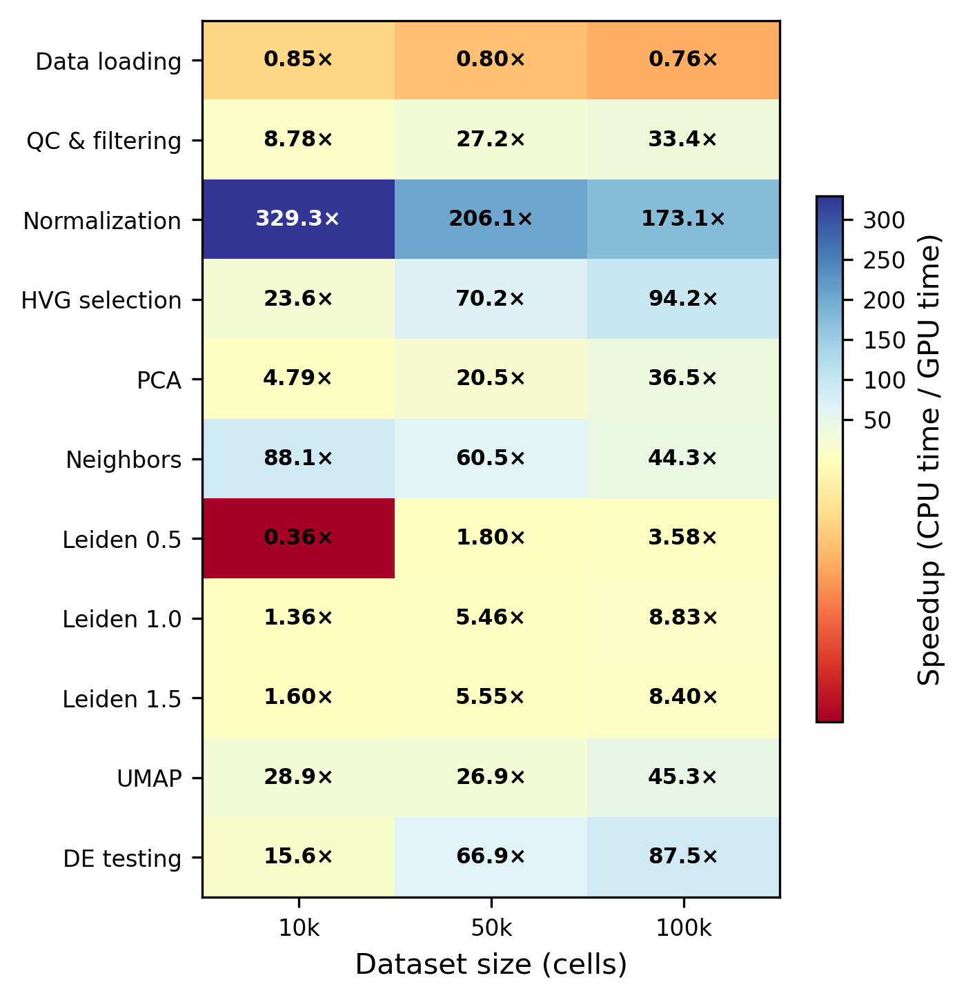
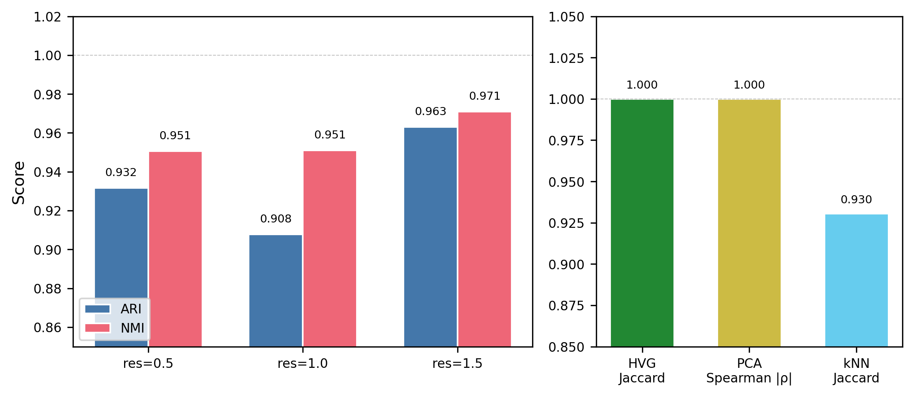
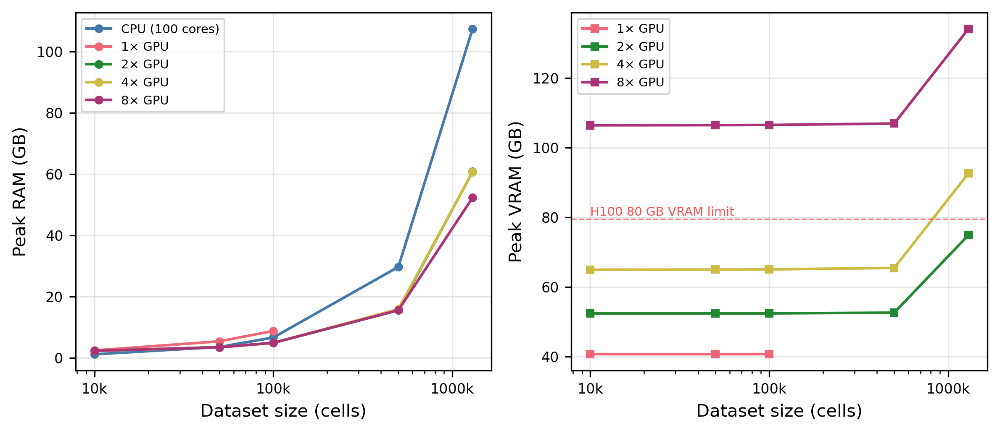
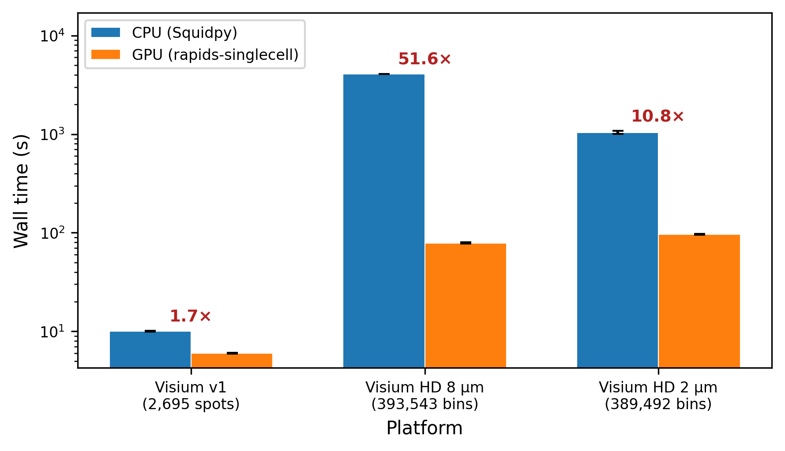

## The scale problem {background-color="#0b3d63" background-opacity="0.05"}

::: {.columns}
::: {.column width="55%"}
- Single-cell RNA-seq datasets now routinely exceed **1 million cells**
- Spatial platforms (Visium HD) produce **hundreds of thousands of bins** per section
- The standard tools (**Scanpy**, **Squidpy**) are **CPU-bound**
- A full atlas-scale analysis can take **hours to days**
:::
::: {.column width="45%"}
### The question
> Can GPUs make atlas-scale single-cell analysis routine — **without changing the biology**?
:::
:::

::: notes
Good morning. Single-cell RNA sequencing has become the workhorse for studying cellular heterogeneity, and datasets have exploded in size — a million cells is now routine, and spatial platforms like Visium HD push us into hundreds of thousands of measurement bins per tissue section.

The problem is that the dominant tools, Scanpy and Squidpy, run on CPU, and at atlas scale a complete pipeline can take a full day. So our question was simple: can GPUs make this routine, and can they do it without changing the biological conclusions we draw? That last part matters, because a fast wrong answer is worthless.
:::

## What we benchmarked

::: {.columns}
::: {.column width="50%"}
**Hardware**

- NVIDIA **DGX H100** node: 8× H100 80 GB, 112 cores, 2 TB RAM
- Spatial: local **RTX 4090** workstation

**Software**

- CPU: **Scanpy 1.12** (100 threads)
- GPU: **rapids-singlecell 0.14.1** (RAPIDS / CuPy / cuGraph)
- Reproducible **Singularity** containers
:::
::: {.column width="50%"}
**Five questions**

1. Per-step & end-to-end **speedup**
2. **Multi-GPU** scaling (1→8 H100)
3. Biological **concordance** (CPU vs GPU)
4. **Maximum capacity** on one node
5. Generalisation to **spatial** transcriptomics
:::
:::

::: notes
Here's the setup. Single-cell ran on a DGX H100 node: eight H100s, 112 CPU cores, 2 terabytes of RAM. Spatial ran on a modest local workstation with a single consumer RTX 4090, to show the results aren't limited to elite hardware.

On the software side we compared Scanpy on CPU, using all 100 threads, against rapids-singlecell on GPU — that's a near drop-in replacement built on the RAPIDS ecosystem. Everything ran inside Singularity containers built from a fixed NVIDIA base image, so the whole thing is reproducible.

Five questions organise the rest of the talk, and they are on the slide: speedup, multi-GPU scaling, biological concordance, maximum capacity, and whether any of it carries over to spatial. Let's take them in turn.
:::

## The pipeline is identical on both sides

- Same dataset: **10x 1.3M mouse brain cells**, subsampled to 10k / 50k / 100k / 500k / 1.3M
- Same parameters: QC → normalise → **2,000 HVGs** → PCA (50) → kNN (k=15) → **Leiden** → UMAP → **Wilcoxon DE**
- Same seed (42), **five independent repeats** per configuration
- Concordance measured directly: HVG Jaccard, PCA correlation, ARI/NMI, DE log-fold-change

::: notes
A benchmark is only fair if both pipelines do exactly the same work, so we were strict. Same input, the 10x 1.3-million mouse brain dataset, subsampled to five sizes. Same parameters at every step, as listed here. Same seed, and five independent repeats of every configuration, so we have error bars rather than single runs.

And rather than just assuming the outputs match, we measured concordance directly at each stage — gene-selection overlap, PCA correlation, clustering agreement, and differential-expression correlation. Those numbers come back later in the talk.
:::

## Up to 120× faster end-to-end {.smaller}

{width="62%"}

::: notes
What is on the screen is the per-step picture: a single GPU against CPU Scanpy, at ten, fifty and a hundred thousand cells. The speedups are wildly uneven, spanning two orders of magnitude. Normalisation, trivially parallel element-wise arithmetic, hits 329-fold at ten thousand cells. Neighbours and UMAP are in the tens. And notice the one place where CPU wins: data loading, at the far left, because the GPU pays a fixed cost to initialise its CUDA context. So the profile of your pipeline decides what you actually get out of a GPU.

The number in the title is a different measurement, so let me be explicit about it. The 120-fold is end to end on the full 1.3 million cells with eight GPUs: 435 seconds against fourteen and a half hours on CPU. There are no per-step single-GPU numbers above a hundred thousand cells, because from 500k upwards the standard pipeline no longer fits in one H100. That constraint comes back two slides from now.
:::

## Where the time goes {.smaller}

{width="70%"}

::: notes
Same result as absolute wall time rather than ratios, and the bottleneck becomes obvious. On CPU, the tall bars, two steps eat almost all the time: differential expression and neighbour-graph construction. On GPU everything collapses to seconds.

This is why the per-step view matters. If you only accelerate the cheap steps you save nothing. The value here is that the GPU crushes exactly the two operations that dominated CPU runtime.
:::

## More GPUs help less than you'd hope {.smaller}

::: {.columns}
::: {.column width="60%"}
{width="100%"}
:::
::: {.column width="40%"}
- 8 GPUs only **12% faster** than 2 GPUs at 1.3M cells
- In an 8-GPU run: **75%** of wall time is CPU preprocessing
- Only **4%** runs on multiple GPUs
- Classic **Amdahl's law**
:::
:::

::: notes
Now a result that surprised us. You might expect that if two GPUs are good, eight are four times better. They're not. Beyond two GPUs these curves are almost flat: at 1.3 million cells, eight GPUs were only twelve percent faster than two. And to be clear before I explain it, this does not undercut the headline. The 120-fold comes from moving to GPU at all, not from having eight of them: two GPUs already give 105-fold at 1.3 million cells, and the other six buy thirteen percent.

Why? Because when we profiled an eight-GPU run, seventy-five percent of the wall time was preprocessing running on the host CPU: loading, filtering, normalising, HVG selection. That sounds like it contradicts the heatmap I showed earlier, so let me be precise. At 500k and 1.3 million cells the data no longer fits in the 80 gigabytes of a single H100, so the multi-GPU Dask path was the only way to run at all. And in that path, only PCA and the neighbour graph had distributed implementations; the preprocessing steps had no multi-GPU route, so they fell back to the host. Normalisation is still 329-fold faster on one GPU. This is a limit of the software stack, not of the operation. Only four percent of the time was in the part that actually benefits from more GPUs, the distributed PCA and neighbours. This is textbook Amdahl's law: your speedup is capped by the part you didn't parallelise. The preprocessing is the anchor.
:::

## So use the node differently

::: {.callout-tip}
## Practical takeaway
A DGX node is better used as **eight independent single-GPU workers** running eight analyses in parallel — than as one 8-GPU worker on a single analysis.
:::

- Most of the value is on **one** GPU
- A single cloud-rented H100 (**~\$2–4/hour**) captures nearly all the benefit
- GPU acceleration is **accessible**, not just for those with a DGX

::: notes
That flips into a useful piece of advice. If adding GPUs to one job barely helps, the efficient way to use an eight-GPU node is to run eight separate analyses, one per GPU, in parallel. Eight times the throughput instead of twelve percent off one job.

And because nearly all the benefit lives on a single GPU, you don't need a DGX. A cloud H100 at two to four dollars an hour gives you almost the entire speedup.
:::

## The biology is preserved {.smaller}

::: {.columns}
::: {.column width="58%"}
{width="100%"}
:::
::: {.column width="42%"}
- HVG selection **identical** (Jaccard = 1.0)
- PCA loadings **perfectly correlated** (|ρ| = 1.0)
- Leiden **ARI 0.908–0.963**, NMI 0.951–0.971
- DE log-fold-change **ρ = 0.946**

**Speed without changing conclusions.**
:::
:::

::: notes
This is the slide that makes the speed meaningful. A faster pipeline is only useful if it gives you the same answer, so we compared the outputs directly.

Gene selection was identical, a Jaccard index of exactly one. PCA loadings correlated perfectly. Leiden agreement was 0.91 to 0.96 on the adjusted Rand index, and differential-expression fold-changes correlated at 0.95. The small residual differences come from GPU floating-point non-determinism and from stochastic steps like Leiden and UMAP, well within what you would see re-running the CPU pipeline with a different seed. Same biology, one to two orders of magnitude faster.
:::

## How far can one node go? {.smaller}

::: {.columns}
::: {.column width="55%"}
{width="100%"}
:::
::: {.column width="45%"}
- Succeeded at **11.9M cells** on one DGX node
- Failed at 12.0M (Leiden OOM)
- The wall is **CPU RAM (535 GB)**, not GPU VRAM
- Aggregate VRAM only **7.6%** of the 640 GB available
:::
:::

::: notes
Next we pushed a memory-optimised version of the pipeline to find the breaking point on a single node. It succeeded at 11.9 million cells — 119 minutes — and failed at twelve million, when Leiden clustering ran out of memory.

But here's the counterintuitive part, shown in this memory profile. The thing that ran out was not GPU memory. Aggregate VRAM across all eight GPUs stayed flat and low, only 7.6 percent of the 640 gigabytes available. The wall is on the CPU side.

One honest caveat on that 535 gigabyte figure, because it invites the obvious question. That is not the memory the job was using when it died. It is the resident memory of the parent process, sampled between one step and the next, while eight Dask workers ran that the sampler never saw and the scheduler did count. The trace even contains a three hundred gigabyte jump that belongs to no measured step. So our working hypothesis is short-lived allocations inside Scanpy's preprocessing, above all the duplicate raw matrix its differential expression backend requires. What we can rule out is clustering: Leiden runs on the GPU here and added under a gigabyte of host memory. The headline holds either way, and it is the useful part: the ceiling sits on the CPU side while GPU memory stays nearly empty. Buy system RAM, not more GPUs.
:::

## Differential expression: pseudo-bulk wins twice {.smaller}

| Method | Time @ 3.4M cells | Note |
|:-------|------------------:|:-----|
| CPU t-test (cell-level) | 5,598 s | baseline |
| GPU Wilcoxon | 826 s | |
| **Pseudo-bulk aggregation** | **128 s** | **44× faster** |

- Pseudo-bulk is the **fastest** *and* the most **statistically rigorous** (avoids pseudoreplication)
- Fast and correct are not in tension here

::: notes
Differential expression deserves its own slide, because it was the single biggest time sink on CPU. We benchmarked three approaches at 3.4 million cells. The cell-level t-test on CPU took over 5,500 seconds. GPU Wilcoxon brought that to 826. But pseudo-bulk aggregation — where you sum counts within each cluster-donor group before testing — finished in 128 seconds, 44 times faster than the CPU t-test.

And the beautiful thing is that pseudo-bulk isn't a speed-versus-correctness tradeoff. It's also the more statistically rigorous choice, because it avoids pseudoreplication — treating thousands of cells from one donor as independent samples, which inflates significance. So for multi-donor experiments, the fastest method is also the most correct one. You rarely get to say that.
:::

## It generalises to spatial transcriptomics {.smaller}

::: {.columns}
::: {.column width="60%"}
{width="100%"}
:::
::: {.column width="40%"}
- Up to **51.6×** end-to-end (Visium HD 8 µm)
- Co-occurrence analysis: **3,272×**
- Spatial autocorrelation concordance **ρ ≥ 0.9995**
- On a **single consumer RTX 4090**
:::
:::

::: notes
Finally, does this carry beyond single-cell? We ran the same kind of benchmark on spatial transcriptomics — three 10x Visium platforms — and on the modest RTX 4090, not the DGX.

End-to-end, up to 51-fold on the high-resolution Visium HD data. One operation stood out: co-occurrence analysis, order-n-squared on CPU, sped up by a factor of 3,272. That's the kind of quadratic work GPUs were made for. Concordance was again essentially perfect: Moran's I and Geary's C correlated at 0.9995 or better. One honest caveat: clustering agreement diverged on the highest-resolution data, because the CPU and GPU Leiden implementations break near-degenerate partitions differently. It's in the paper.

A word on why the RTX 4090 rather than the DGX, because it is a fair question. The cluster runs driver 535, which caps the CUDA runtime at 12.2. The single-cell pipeline ran there fine through forward compatibility, but the GPU components of the spatial stack did not, and when we tried to downgrade the container to an older RAPIDS release the spatial dependencies, Squidpy's GPU backend and spatialdata, could not be resolved at all. That is not a dig at our sysadmins: a shared production node cannot chase driver releases that break half the Python stack for everyone else on it, so updating conservatively is the right call. It is a real constraint of this software on shared infrastructure, and it is worth naming, because right now a consumer workstation can be the more practical place to run a GPU spatial pipeline than the cluster.
:::

## Takeaways {background-color="#0b3d63" background-opacity="0.06"}

1. **120× faster** end-to-end, with **biologically concordant** results
2. Bottleneck is **CPU preprocessing**, not GPU compute — so most value is on **one GPU**
3. Scaling limit is **CPU RAM**, not VRAM (11.9M cells on one node)
4. **Pseudo-bulk DE** is fastest *and* most rigorous
5. Generalises to **spatial** (51.6×) — even on consumer hardware

::: {.callout-note}
Code, containers, and all benchmark data: **github.com/lucavd/2026.scRNA_DGX**
:::

::: notes
Five things to remember. One: up to a 120-fold end-to-end speedup with biologically concordant results. Two: the bottleneck is CPU-side preprocessing, not GPU compute, which is why most of the value sits on a single GPU. Three: the ceiling is CPU RAM, not GPU memory; we reached 11.9 million cells on one node. Four: for differential expression, pseudo-bulk is both the fastest and the most statistically correct choice. Five: it generalises to spatial, over 50-fold, on a consumer card.

Everything — the code, the Singularity containers, and every benchmark JSON — is public on GitHub. Thank you, and I'm happy to take questions.
:::

## Thank you {.center}

**Luca Vedovelli** · luca.vedovelli@ubep.unipd.it

Unit of Biostatistics, Epidemiology and Public Health — University of Padova
BIOSTAT-X — Pediatric Research Institute «Città della Speranza»

*Acknowledgements: UPSCALE / CONVECS HPC, University of Padova (DGX H100).*
*Funded by PNC "DARE" (PNC0000002) and BIRD 2024/START (SID) programs.*

::: notes
Thank-you slide with contact details and funding acknowledgements — the UPSCALE and CONVECS HPC infrastructure at Padova that provided the DGX H100, and our funding from the national DARE plan and the BIRD START programs. Leave this up during questions.
:::
